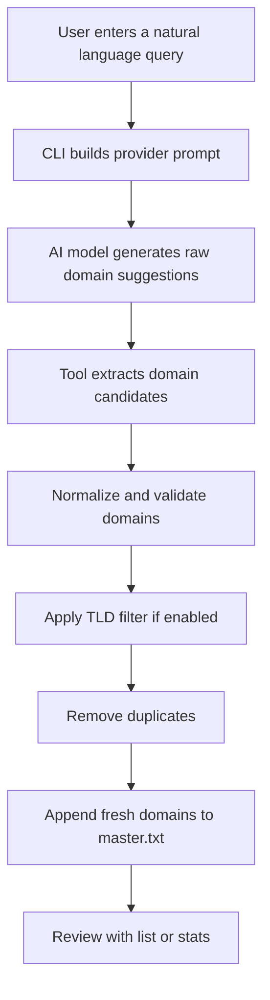

# Domain Grabber AI

<p align="center">
  
</p>

<p align="center">
  
</p>

<p align="center">
  
  
  
  
</p>

<p align="center">
  
  
  
  
  
</p>

<p align="center">
  <a href="https://github.com/AnggaTechI/Domain-Grabber-AI/releases/download/v1.0.0/domgrab.exe">
    
  </a>
  <a href="https://github.com/AnggaTechI/Domain-Grabber-AI/releases/download/v1.0.0/domgrab">
    
  </a>
</p>

<p align="center">
  <b>AI-powered CLI tool to discover, filter, and collect real domains from natural language queries.</b>
</p>

---

> [!IMPORTANT]
> **Precompiled binaries are ready.**
>
> - **Windows**: [`domgrab.exe`](https://github.com/AnggaTechI/Domain-Grabber-AI/releases/download/v1.0.0/domgrab.exe)
> - **Linux**: [`domgrab`](https://github.com/AnggaTechI/Domain-Grabber-AI/releases/download/v1.0.0/domgrab)
>
> Download them from the **Releases** page and run directly without building from source.

---

## Overview

**Domain Grabber AI** helps you turn a simple natural language prompt into a clean list of real domains.

Instead of manually searching and collecting domains one by one, you can ask for things like:

- universities in Indonesia
- government domains from Brazil
- educational institutions in Germany
- startup companies in Southeast Asia
- real estate companies in Singapore

The tool will:

- query the selected AI provider
- extract domain candidates from raw model output
- normalize and validate domains
- apply TLD filters if needed
- remove duplicates automatically
- save only fresh results into your master list

It is useful for domain research, niche dataset building, lead collection, and automation workflows.

---

## Highlights

- Natural language domain discovery
- Multi-provider AI support
- Per-provider model configuration
- Automatic provider selection from available API keys
- Domain normalization and validation
- TLD filtering support
- Duplicate prevention
- Persistent master list storage
- Built-in `list` and `stats` commands
- Portable `domgrab.json` config file
- Ready-to-use Windows and Linux binaries

---

## Supported Providers

- Anthropic
- OpenAI
- Gemini
- Groq
- OpenRouter

Each provider can use its own model through `domgrab.json`.

---

## How It Works



---

## Quick Start

### Windows

```bash
domgrab.exe config set gemini_api_key YOUR_GEMINI_KEY
domgrab.exe config set default_provider gemini
domgrab.exe config set gemini_model gemini-3-flash-preview
domgrab.exe grab --query "universities in Indonesia" --target 100 --batch 20 --tld ac.id
```

### Linux

```bash
chmod +x domgrab
./domgrab config set gemini_api_key YOUR_GEMINI_KEY
./domgrab config set default_provider gemini
./domgrab config set gemini_model gemini-3-flash-preview
./domgrab grab --query "universities in Indonesia" --target 100 --batch 20 --tld ac.id
```

---

## Download Precompiled Binaries

### Direct Downloads

- [Windows Binary](https://github.com/AnggaTechI/Domain-Grabber-AI/releases/download/v1.0.0/domgrab.exe)
- [Linux Binary](https://github.com/AnggaTechI/Domain-Grabber-AI/releases/download/v1.0.0/domgrab)

### Usage

**Windows**
```bash
domgrab.exe grab --query "universities in Indonesia" --target 100 --batch 20 --tld ac.id
```

**Linux**
```bash
chmod +x domgrab
./domgrab grab --query "universities in Indonesia" --target 100 --batch 20 --tld ac.id
```

---

## Project Structure

```bash
Domain-Grabber-AI/
├── main.go
├── go.mod
├── README.md
│
├── internal/
│   ├── core/
│   │   ├── config.go
│   │   ├── provider.go
│   │   ├── domain.go
│   │   └── store.go
│   │
│   └── cli/
│       ├── grab.go
│       ├── config_cmd.go
│       └── commands.go
```

---

## Installation

### Clone the repository

```bash
git clone https://github.com/AnggaTechI/Domain-Grabber-AI.git
cd Domain-Grabber-AI
```

### Build from source

**Windows**
```bash
go build -o domgrab.exe .
```

**Linux / macOS**
```bash
go build -o domgrab .
```

---

## Basic Usage

```bash
domgrab <command> [flags]
```

### Commands

- `grab` — Grab domains via AI from a natural language query
- `list` — Show domains in the master list
- `stats` — Show domain statistics
- `config` — Manage API keys, models, and defaults
- `version` — Show version information
- `help` — Show help message

---

## Example Workflow

### Input

```bash
domgrab.exe grab --query "universities in Indonesia" --target 100 --batch 20 --tld ac.id
```

### Process

1. The CLI loads your configuration.
2. It selects the provider and model.
3. It sends the prompt to the AI provider.
4. The model returns raw text.
5. The tool extracts valid domains.
6. The TLD filter is applied.
7. Duplicate domains are removed.
8. New results are saved to `master.txt`.

### Sample Output

```txt
ugm.ac.id
ui.ac.id
itb.ac.id
unair.ac.id
ipb.ac.id
```

---

## Configuration

Configuration is stored in:

```bash
./domgrab.json
```

### Example Config

```json
{
  "anthropic_api_key": "",
  "openai_api_key": "",
  "gemini_api_key": "YOUR_GEMINI_KEY",
  "groq_api_key": "",
  "openrouter_api_key": "",
  "default_provider": "gemini",
  "default_model": "",
  "default_output": "master.txt",
  "anthropic_model": "claude-opus-4-7",
  "openai_model": "gpt-4o",
  "gemini_model": "gemini-3-flash-preview",
  "groq_model": "llama-3.3-70b-versatile",
  "openrouter_model": "meta-llama/llama-3.3-70b-instruct:free"
}
```

---

## Provider Resolution Logic

**Provider selection order**
1. `--provider` flag
2. `default_provider` in config
3. First available provider with a valid API key
4. Fallback to `anthropic`

**API key resolution order**
1. `--api-key` flag
2. Environment variable
3. `domgrab.json`

**Model resolution order**
1. `--model` flag
2. Provider-specific model from config
3. `default_model`
4. Provider fallback model

---

## More Examples

### Grab Indonesian university domains

```bash
domgrab.exe grab --query "universities in Indonesia" --target 100 --batch 20 --tld ac.id
```

### Grab Brazilian government domains

```bash
domgrab.exe grab --query "government domains from Brazil" --target 200 --batch 25 --tld gov.br
```

### Grab German university domains

```bash
domgrab.exe grab --provider gemini --query "universities in Germany" --target 100 --batch 10
```

### Use a custom output file

```bash
domgrab.exe grab --query "tech companies in Singapore" --target 150 --output singapore.txt
```

### List domains containing a keyword

```bash
domgrab.exe list --filter uin
```

### Show TLD stats

```bash
domgrab.exe stats
```

---

## Example CLI Output

```txt
═══════════════════════════════════════════
 domgrab v1.0.0
 author   : AnggaTechI
 github   : https://github.com/AnggaTechI
═══════════════════════════════════════════
 provider : gemini (key: AQ.Ab8R...Xxvg, from config)
 model    : gemini-3-flash-preview
 query    : universities in Indonesia
 target   : 100 new domains
 batch    : 20 per request
 output   : master.txt (currently 0 domains)
 tld      : ac.id
═══════════════════════════════════════════
```

---

## Why Use Domain Grabber AI?

- Build domain datasets faster
- Discover niche websites by topic or country
- Collect institutional domains in bulk
- Keep everything in one clean master list
- Automate repetitive domain research tasks
- Combine AI generation with your own filtering strategy

---

## Notes

- `master.txt` is the default output file
- Domains are normalized before saving
- Duplicate domains are skipped automatically
- TLD filters are optional
- Different AI providers may have different rate limits
- Results depend on the prompt quality and selected model

---

## Repository

GitHub Repository: https://github.com/AnggaTechI/Domain-Grabber-AI

---

## Author

**AnggaTechI**  
GitHub: https://github.com/AnggaTechI

---

## License

This project is released under the MIT License.

---

<p align="center">
  
</p>
