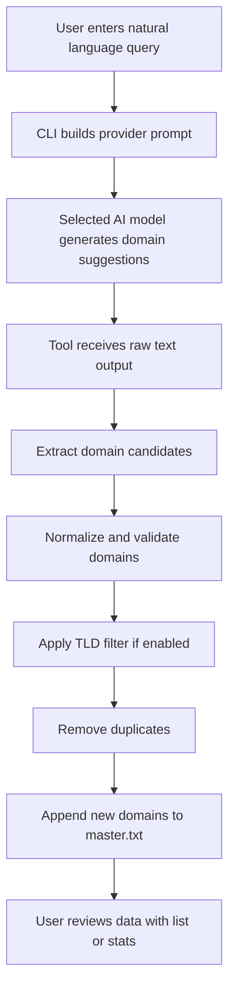

# Domain Grabber AI

<p align="center">
  
</p>

<p align="center">
  
</p>

<p align="center">
  
  
  
  
</p>

<p align="center">
  
  
  
  
  
</p>

---

## Overview

**Domain Grabber AI** is a command-line tool that uses AI models to generate domain lists from simple natural language prompts.

Instead of manually searching and collecting domain names one by one, you can write a prompt like:

- universities in Indonesia
- government domains from Brazil
- educational institutions in Germany
- startup companies in Southeast Asia
- real estate companies in Singapore

The tool will then:

- send your query to the selected AI provider
- receive raw text output from the model
- extract valid domain names from the response
- normalize each domain into a clean format
- filter by TLD if needed
- remove duplicates
- save only new domains into a master list

This makes it useful for domain research, lead building, OSINT-style collection workflows, niche dataset creation, and bulk domain organization.

---

## Key Features

- Natural language domain discovery
- Clean CLI workflow
- Multi-provider AI support
- Per-provider model configuration
- Automatic provider selection from available API keys
- Domain normalization and validation
- TLD filtering support
- Duplicate prevention
- Persistent master list storage
- Domain listing command
- Domain statistics command
- Portable JSON config file
- Works on Windows, Linux, and macOS

---

## Supported Providers

- Anthropic
- OpenAI
- Gemini
- Groq
- OpenRouter

Each provider can use its own custom model from `domgrab.json`.

---

## How It Works



---

## Real Workflow Example

### Input

```bash
 domgrab.exe grab --query "universities in Indonesia" --target 100 --batch 20 --tld ac.id
```

### Internal Process

1. The CLI reads your configuration.
2. It selects the provider and API key.
3. It builds a prompt for the AI model.
4. The model returns raw lines of text.
5. The tool extracts only valid domains.
6. It filters results using `ac.id`.
7. It removes duplicates from the master list.
8. It saves only fresh domains.

### Output

A clean `master.txt` file containing real domains such as:

```txt
ugm.ac.id
ui.ac.id
itb.ac.id
unair.ac.id
ipb.ac.id
```

---

## Project Structure

```bash
domgrab/
├── main.go
├── go.mod
├── README.md
│
├── internal/
│   ├── core/
│   │   ├── config.go
│   │   ├── provider.go
│   │   ├── domain.go
│   │   └── store.go
│   │
│   └── cli/
│       ├── grab.go
│       ├── config_cmd.go
│       └── commands.go
```

---

## Installation

### Clone the repository

```bash
git clone https://github.com/AnggaTechI/domgrab.git
cd domgrab
```

### Build on Windows

```bash
go build -o domgrab.exe .
```

### Build on Linux / macOS

```bash
go build -o domgrab .
```

---

## Basic Usage

```bash
domgrab <command> [flags]
```

### Available Commands

- `grab`      Grab domains via AI from a natural language query
- `list`      Show domains in the master list
- `stats`     Show domain statistics
- `config`    Manage API keys, models, and defaults
- `version`   Show version information
- `help`      Show help message

---

## Quick Start

### 1. Set your API key

Example using Gemini:

```bash
domgrab.exe config set gemini_api_key YOUR_GEMINI_KEY
domgrab.exe config set default_provider gemini
domgrab.exe config set gemini_model gemini-3-flash-preview
```

### 2. Start grabbing domains

```bash
domgrab.exe grab --query "universities in Indonesia" --target 100 --batch 20 --tld ac.id
```

### 3. List saved domains

```bash
domgrab.exe list --tld ac.id --limit 50
```

### 4. Show statistics

```bash
domgrab.exe stats
```

---

## Configuration

Configuration is stored in:

```bash
./domgrab.json
```

### Example Config

```json
{
  "anthropic_api_key": "",
  "openai_api_key": "",
  "gemini_api_key": "YOUR_GEMINI_KEY",
  "groq_api_key": "",
  "openrouter_api_key": "",
  "default_provider": "gemini",
  "default_model": "",
  "default_output": "master.txt",
  "anthropic_model": "claude-opus-4-7",
  "openai_model": "gpt-4o",
  "gemini_model": "gemini-3-flash-preview",
  "groq_model": "llama-3.3-70b-versatile",
  "openrouter_model": "meta-llama/llama-3.3-70b-instruct:free"
}
```

---

## Provider Resolution Logic

Provider selection order:

1. `--provider` flag
2. `default_provider` in config
3. First available provider with a valid API key
4. Fallback to `anthropic`

API key resolution order:

1. `--api-key` flag
2. Environment variable
3. `domgrab.json`

Model resolution order:

1. `--model` flag
2. Provider-specific model from config
3. `default_model`
4. Provider internal fallback model

---

## Command Examples

### Grab Indonesian university domains

```bash
domgrab.exe grab --query "universities in Indonesia" --target 100 --batch 20 --tld ac.id
```

### Grab Brazilian government domains

```bash
domgrab.exe grab --query "government domains from Brazil" --target 200 --batch 25 --tld gov.br
```

### Grab German university domains

```bash
domgrab.exe grab --provider gemini --query "universities in Germany" --target 100 --batch 10
```

### Use a custom output file

```bash
domgrab.exe grab --query "tech companies in Singapore" --target 150 --output singapore.txt
```

### List domains containing a keyword

```bash
domgrab.exe list --filter uin
```

### Show top TLD stats

```bash
domgrab.exe stats
```

---

## Example Output

```txt
═══════════════════════════════════════════
 domgrab v1.0.0
 author   : AnggaTechI
 github   : https://github.com/AnggaTechI
═══════════════════════════════════════════
 provider : gemini (key: AQ.Ab8R...Xxvg, from config)
 model    : gemini-3-flash-preview
 query    : universities in Indonesia
 target   : 100 new domains
 batch    : 20 per request
 output   : master.txt (currently 0 domains)
 tld      : ac.id
═══════════════════════════════════════════
```

---

## What Makes It Useful?

Domain Grabber AI is useful when you want to:

- build domain datasets quickly
- discover niche websites by topic or country
- collect institution domains in bulk
- organize targets into one clean list
- automate repetitive domain research workflows
- combine AI generation with your own filtering strategy

---

## Notes

- `master.txt` is the default output file
- Domains are normalized before saving
- Duplicate domains are skipped automatically
- TLD filters are optional
- Different AI providers may have different quotas and speed limits
- Generated results depend on the quality of the prompt and the model

---

## Author

**AnggaTechI**  
GitHub: https://github.com/AnggaTechI

---

## License

This project is released under the MIT License.

---

<p align="center">
  
</p>
